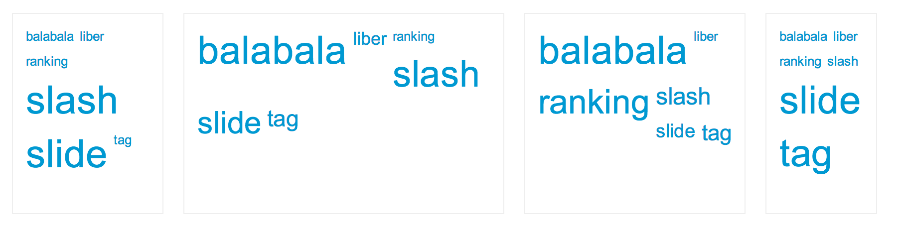

# Hotag

Hotag = Hot Tag  
Smart show your hot tags, similar with tag cloud.



## Quick start

Download the [production version][min] or the [development version][max].

[min]: https://raw.github.com/Mystist/hotag/master/dist/jquery.hotag.min.js
[max]: https://raw.github.com/Mystist/hotag/master/dist/jquery.hotag.js

In your web page:

```html
<style>
  .hotag-container {
    width: 100%;
    font-family: arial,helvetica,clean,sans-serif;
    font-size: 13px;
    font-weight: normal;
    padding: 10px 0;
    float: left;
  }
  .hotag-container a {
    margin: 5px 3px;
    color: #0099d2;
    text-decoration: none;
    float: left;
  }
  .hotag-container a:hover {
    text-decoration: underline;
  }
</style>

<div id="container"></div>

<script src="jquery.js"></script>
<script src="dist/jquery.hotag.min.js"></script>
<script>
(function($) {
  var tags = [{"counts":1,"tag":"balabala"},{"counts":1,"tag":"liber"},{"counts":1,"tag":"ranking"},{"counts":2,"tag":"slash"},{"counts":2,"tag":"slide"},{"counts":1,"tag":"tag"}];
  $('#container').hotag({tags: tags});
})(jQuery);
</script>
```

## Documentation

### Getting started  
 - Install `Nodejs` on your computer. Make sure `bower --version`, `grunt --version` returns properly. If not, run `npm install -g grunt-cli bower`.
 - [Download the latest source code](https://github.com/Mystist/hotag/releases).
 - Run `npm install`, `bower install` to install devDependencies.
 - Run `grunt`. Make sure you can see `Done, without errors.` Congratulations!

### Examples
 - Run `grunt serve`, visit `http://localhost:9000/src/demo.html` to see the demo.
 
### Options

Options defaults to beblow:  

```javascript
tags: [], // Data source. Example: `tags: [{"theCounts":12,"tagName":"balabala", "src": "http://balabala.com"}]`
keyOfName: 'tag', // Example: `tagName`. See at above, we use tagName there.
keyOfCounts: 'counts', // Example: `theCounts`.
keyOfHref: 'href', // Example: `src`
containerClass: 'hotag-container' // Use this to customize your owe CSS.
minFontByPercent: 100, // Fonts is based on your css set to the container.
maxFontByPercent: 230  
```

